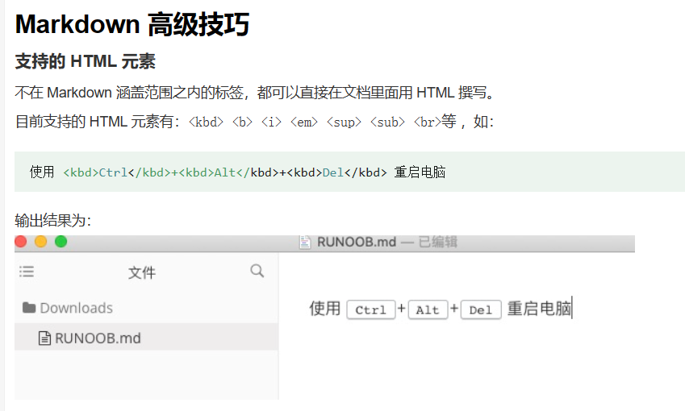

# Markdown语法
## 1. 标题
使用 # 号可表示 1-6 级标题，一级标题对应一个 # 号，二级标题对应两个 # 号，以此类推。

## 2. 段落
### (1) 字体
斜体：前后2个\*或_  
粗体：前后2对\**或__  
粗斜体：前后2对\***或\__
如下所示：  
*斜体文本*
_斜体文本_  
**粗体文本**
__粗体文本__  
***粗斜体文本***
___粗斜体文本___

### (2) 换行
使用两个以上空格或1个TAB加上回车   
第一行  
第二行

### (3) 删除线
只需要在文字的两端加上两个波浪线 ~~  
~~删除线~~

### (4) 下划线
下划线可以通过 HTML 的 \<u> 标签来实现  
<u>下划线</u>

### (5) 脚注
脚注的格式如[^要注明的文本]  
创建脚注[^注释1]。  
[^注释1]: 演示脚注功能。

### (6) 转义字符
在符号前加反斜线\，可以让markdown不去解释该符号
## 3. 列表
### (1) 有序列表
有序列表使用数字加“.”加空格号来表示
1. 第一项
2. 第二项

### (2) 无序列表
无序列表使用星号(*)、加号(+)或是减号(-)作为列表标记，这些标记后面要添加一个空格，显示出来没有区别，但是不同的符号组合使用，会自动添加空白行。
+ 第一项+
+ 第二项+
- 第三项-
- 第四项-
* 第五项*
* 第六项*
列表嵌套只需在子列表中的选项前面添加两个或四个空格即可，1或2个Tab等效，嵌套必须从1起始编号。
但有序嵌套无序需要2个Tab
1. 有序嵌套
   1. 第有序嵌套一层
        1. 有序嵌套二层
* 无序嵌套
  * 无序嵌套一层
    * 无序嵌套二层 
1. 有序嵌套无序需要2个Tab
    * 无序

### (3) 任务清单
-加空格加[]，中间加空格为空任务，加x则会打勾
- [ ] 任务一
- [x] 任务二

## 4. 区块引用
区块引用是在段落开头使用 > 符号 ，然后后面紧跟一个空格符号.
> 引用展示
> > 多个“>”符号加空格可以构成多层引用 

插入一个空行可以结束引用。  
在列表中引用则需要增加缩进
1. 列表区块
  > 区块引用一级
  >> 区块引用二级

## 5. 代码
### (1) 单行代码
如果是段落上的一个函数或片段的代码可以用反引号把它包起来(\`)，只支持单行代码，不支持多行。   
`printf()  
 rand()`

### (2) 代码区块
 
常使用 ``` 包裹一段代码，并指定一种语言（也可以不指定）
```c
  void main()  
  {  
      printf("用tab构建代码区块");  
  } 
```
或者使用4个空格或者一个制表符（Tab 键），但是代码区块内不能便捷地排列代码，因此不推荐该方法。  
  void main()  
  {  
    printf("用tab构建代码区块");  
  }      

## 6. 链接
链接使用方法如下：  
\[链接名称](链接地址)或者<链接地址>  
[Markdown-菜鸟教程](https://www.runoob.com/markdown/md-link.html)  

或者通过**变量**设置链接，变量赋值在文档末尾进行：  
\[网址名称][变量1]  
\[变量1]: 网址  

这个链接用 1 作为网址变量 [Google][1]  
这个链接用 runoob 作为网址变量 [Runoob][runoob]
然后在文档的结尾为变量赋值（网址）  
[1]: http://www.google.com/  
[runoob]: http://www.runoob.com/

## 7. 图片
### (1) 网络图片 
Markdown 图片语法格式如下：  
\![alt 属性文本]\(图片地址)  
\![alt 属性文本]\(图片地址 "可选标题")  
  
  

指定图片的高度与宽度，可以使用普通的 \ 标签  
\  
 

### (2) 本地图片   
复制图片，然后粘贴到对应位置即可。但是如果要显示本地图片，必须要上传图片文件。  
\  

## 8. 表格
Markdown 制作表格使用 | 来分隔不同的单元格，使用 - 来分隔表头和其他行。

语法格式如下：  
\|  表头   \| 表头  \|  
\|  ----  \| ----  \|  
\| 单元格  \| 单元格 \|  
\| 单元格  \| 单元格 \|  

设置表格的对齐方式，默认左对齐：  
-: 设置内容和标题栏居右对齐。 
:- 设置内容和标题栏居左对齐。  
:-: 设置内容和标题栏居中对齐。  
| 左对齐 | 右对齐 | 居中对齐 |
| :-----| ----: | :----: |
| 单元格 | 单元格 | 单元格 |
| 单元格 | 单元格 | 单元格 |


## 9. 流程图
支持流程图语法，用到时再进一步了解
## 10. 公式
2个\$字符可表示行中公式，2对\$字符表示独立公式。